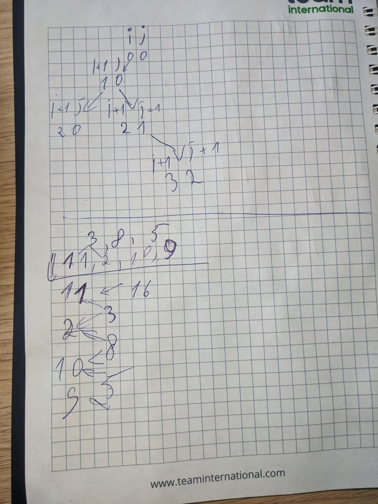

At the first glance it looks like a classic tree and what we need is to just iterate over it using recursion

It's great from functional programming, immutability, etc., but from performance, it's terrible (overheads for the call stack, and later it was confirmed, the app died on 30+ records)

So was chose another algorithm, without recursion, just to iterate over the array and calculate sum for a particular node and store it in a temporary array

Important here is no start from the end of the tree, it allows us over iteration calculate sum for the particular node

Here is some debug on paper (recursive algorithm a nd with temp array)

